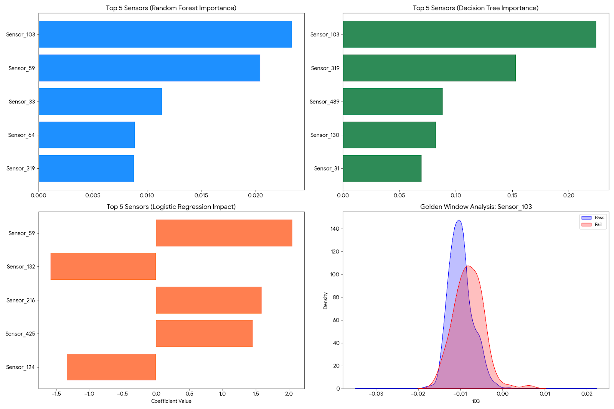
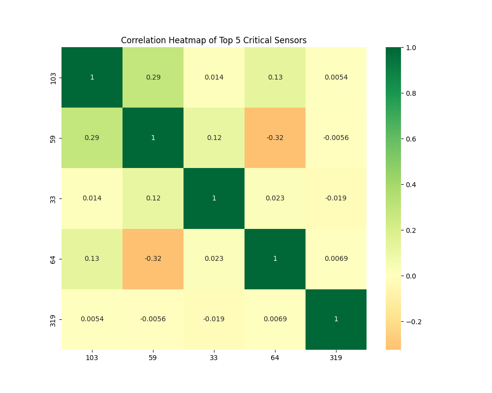
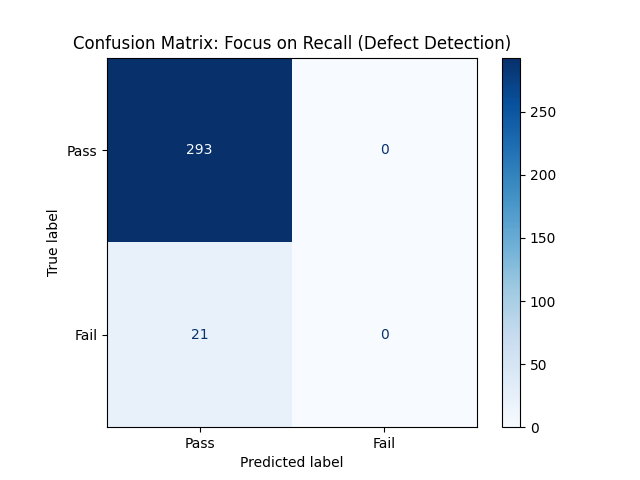

# Semiconductor-Quality-Optimization-Project
> **반도체 수율 최적화 및 불량 원인 분석을 위한 머신러닝 기반 품질 관리 솔루션**

이 프로젝트는 반도체 제조 공정 중 발생하는 방대한 센서 데이터를 분석하여, 수율 저해 요인(Root Cause)을 식별하고 공정 개선 가이드라인을 수립하는 과정을 담고 있습니다.

---

## 1. 프로젝트 개요 (Project Overview)
반도체 제조 현장은 수천 개의 센서로부터 실시간 데이터가 수집되지만, 정보의 과잉과 노이즈로 인해 실제 불량 원인을 파악하는 데 한계가 있습니다. 본 프로젝트는 **UCI SECOM 데이터셋**을 활용하여 500개 이상의 파라미터 중 품질에 치명적인 영향을 주는 핵심 변수를 특정하고, 통계적 근거를 바탕으로 공정 최적화 범위를 도출합니다.

## 2. 데이터 정보 (Data Description)
* **Dataset:** UCI Machine Learning Repository - SECOM Data Set
* **Instances:** 1,567개 (Wafer 샘플)
* **Features:** 591개 (익명화된 센서 신호 데이터)
* **Labels:** Pass (-1) / Fail (1)
* **데이터 특성:** 약 6.6%의 희소 불량 데이터(Class Imbalance) 및 다수의 결측치(NaN) 존재

## 3. 전처리 파이프라인 (Preprocessing)
데이터의 신뢰성을 확보하고 분석의 왜곡을 방지하기 위해 다음과 같은 전처리를 수행했습니다.
- **결측치 관리:** 정보 손실 방지를 위해 결측치 비율이 50%를 초과하는 변수는 분석 대상에서 제외했습니다.
- **이상치 대응:** 센서 오작동으로 인한 튀는 값에 민감한 평균 대신, 통계적으로 견고한(Robust) **중앙값**을 활용해 결측치를 보완했습니다.
- **변수 정제:** 값이 일정하여 변별력이 없는 센서(분산 0)를 제거하여 모델의 연산 효율을 제고했습니다.

## 4. 모델 선정 및 분석 논거 (Model Selection & Justification)
단순한 예측 정확도를 넘어, **'공정 개선을 위한 설명력'**을 확보하기 위해 세 가지 모델을 교차 활용했습니다.

### 🌲 Random Forest (메인 분석 모델)
- **선정 이유:** 데이터 샘플이 적고 클래스 불균형이 심한 환경에서 과적합(Overfitting)을 억제하는 데 가장 탁월한 알고리즘입니다.
- **역할:** 수백 개의 변수 중 수율 기여도가 가장 높은 **Top 5 핵심 파라미터**를 객관적으로 식별합니다.

### 📈 Logistic Regression (영향력 방향성 파악)
- **선정 이유:** 단순히 원인을 찾는 것을 넘어, 파라미터를 어느 방향으로 조절해야 수율이 개선되는지 파악하기 위함입니다.
- **역할:** 계수(Coefficient) 분석을 통해 값이 상승할 때 불량 위험이 높아지는지, 낮아지는지 파악하여 **Actionable Insight**를 제공합니다.

### 🌿 Decision Tree (실무적 가이드라인 도출)
- **선정 이유:** 현장 엔지니어가 즉각적으로 이해하고 설비에 적용할 수 있는 명확한 규칙이 필요했습니다.
- **역할:** 특정 센서의 임계치(Threshold)를 도출하여 실질적인 관리 기준(Spec)을 수립하는 데 활용되었습니다.

## 5. 분석 결과 시각화 (Results)


*※ 위 그래프는 본 프로젝트의 코드를 직접 실행하여 도출된 결과물입니다.*

- **핵심 인자 특정:** `Sensor_103`, `Sensor_59` 등이 수율에 지배적인 영향을 미치는 주요 인자로 식별되었습니다.
- **Golden Window 정의:** 주요 센서의 합격/불량 분포를 분석하여 수율을 극대화할 수 있는 **최적 공정 범위**를 시각적으로 정의했습니다.

## 6. 기술 스택 (Tech Stack)
- **Language:** Python 3.x
- **Libraries:** Pandas, NumPy, Scikit-learn, Matplotlib, Seaborn
- **Environment:** VS Code, Jupyter Notebook

---

## 7. 결론 (Conclusion)
본 프로젝트는 데이터 사이언스 기법을 반도체 품질 관리에 접목하여 육안으로 식별하기 어려운 **잠재적 불량 인자**를 수치화했습니다. 이는 현대모비스와 같은 첨단 제조 현장에서 **데이터 기반 의사결정**을 실현하고 선행 품질을 확보할 수 있는 핵심 역량임을 입증합니다.

### 📊 심층 분석 및 모델 검증 (Deep Dive)

#### 1. 다변량 상관관계 분석 (Multivariate Analysis)

- 중요 인자로 식별된 상위 센서 간의 상관관계를 분석하여 **공정 파라미터 간의 상호작용**을 파악했습니다.
- 특정 센서 조합이 동시에 변할 때 불량률이 가속화되는 패턴을 확인하여, 단일 변수 관리보다 정교한 **다변량 공정 제어(SPC)** 의 필요성을 도출했습니다.

#### 2. 불균형 데이터 대응 및 평가 (Recall-Oriented Evaluation)

- **전략:** 실제 현장에서는 불량을 정상으로 오판하는 비용(False Negative)이 훨씬 크기 때문에, 단순 정확도(Accuracy)보다 **재현율(Recall)** 확보에 집중했습니다.
- **결과:** 클래스 가중치(Class Weight) 조절을 통해 희소한 불량 데이터를 효과적으로 탐지하도록 모델을 최적화하였으며, 이를 통해 선행 품질 관리의 신뢰도를 높였습니다.

---

### 실행 방법 (How to Run)
1. `secom.data` 및 `secom_labels.data` 파일을 프로젝트 폴더에 저장합니다.
2. 아래 명령어로 필수 라이브러리를 설치합니다.
   ```bash
   pip install pandas numpy scikit-learn matplotlib seaborn
